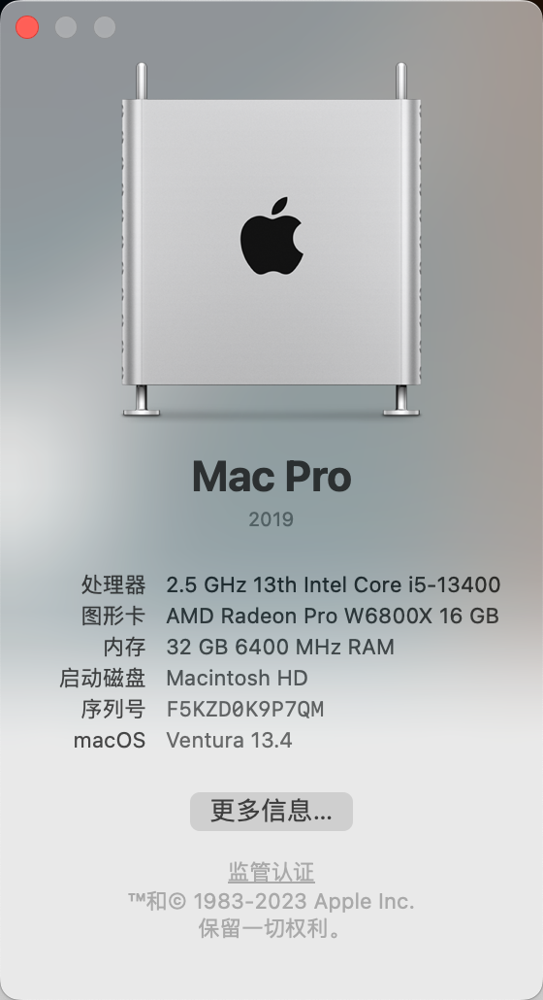
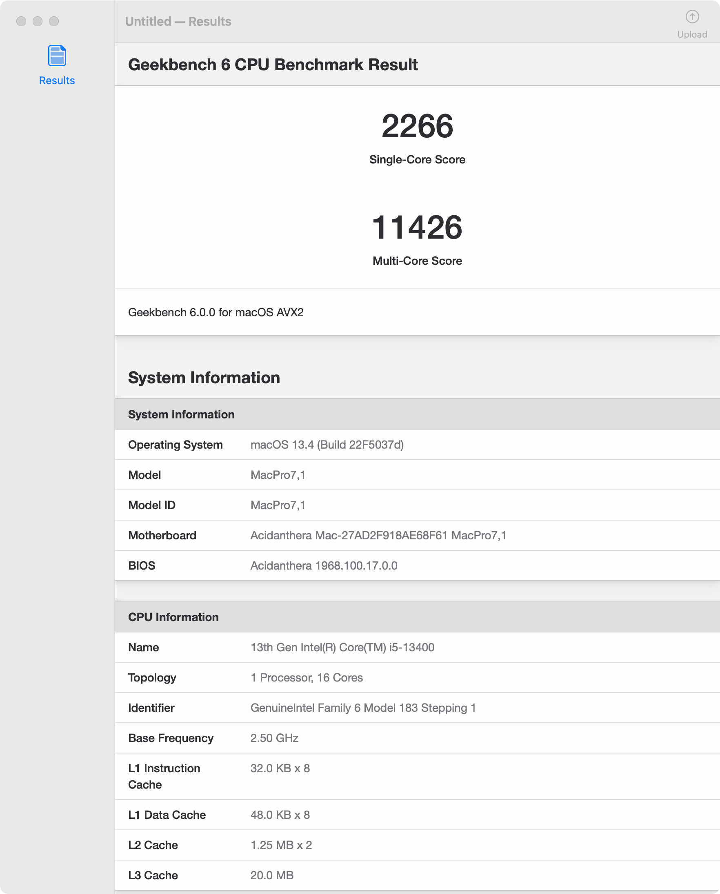

# MAXSUN MS iCraft Z790ITX WIFI Hackintosh EFI

EFI Partition and Guidelines for my Mini-ITX Hackintosh



## Hardware

- MAXSUN MS iCraft Z790ITX WIFI
- Intel Core i5-13400
- Asgard DDR5 6400CL32 16GBx2 RGB
- YESTON RX6800XT-16GD6
- 2xWD Black SN750 1TB NVMe
- USCORSAIR SF750W
- Broadcom BCM943602CS WiFi/BT

## Config

- SMBIOS - MacPro7,1
- Verbose Off
- Scaled for 4K
- `agdpmod=pikera` is enabled for AMD GPU

## Bios

- VT-d - Enabied
- Above 4G decoding - Enabied
- Intei（VMX）- Enabied
- CFG Lock - Disabied

## Changelog

```

0.2.0 - Customized USB port

0.1.1 - initial release

```



